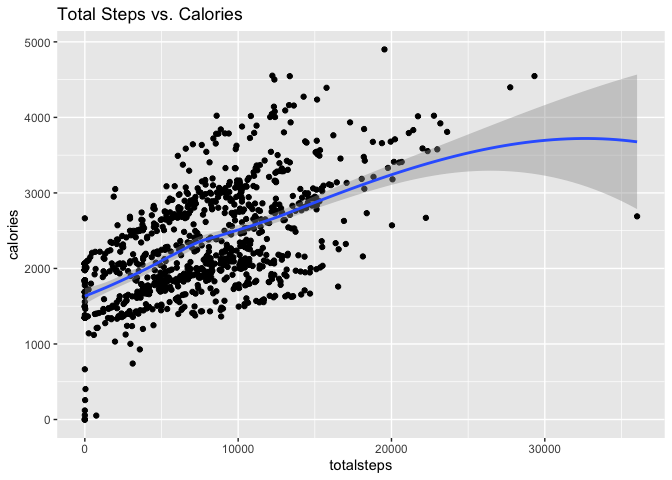
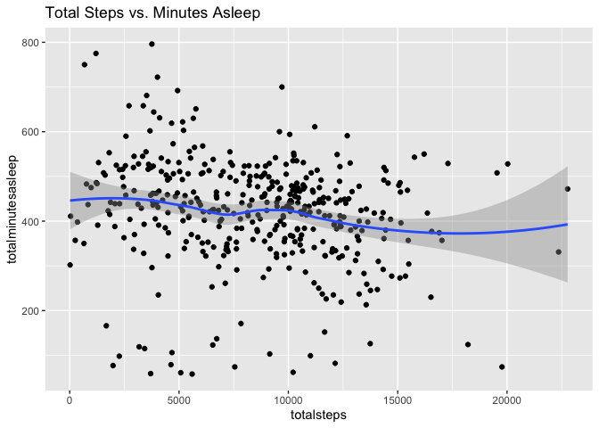
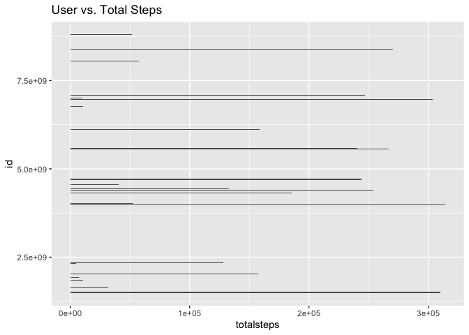
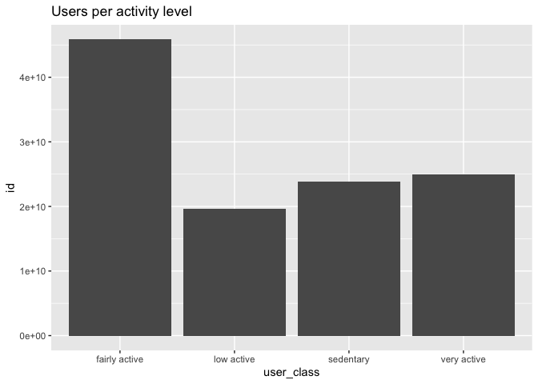
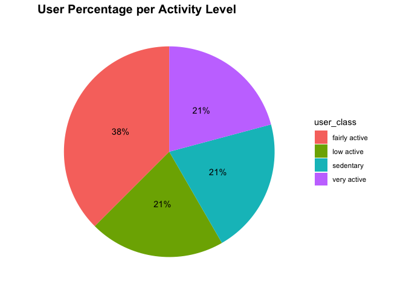
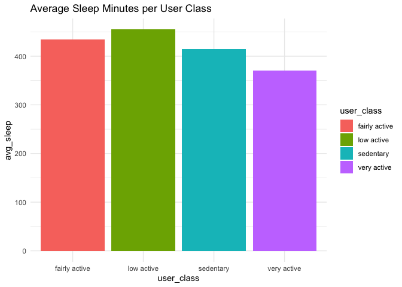
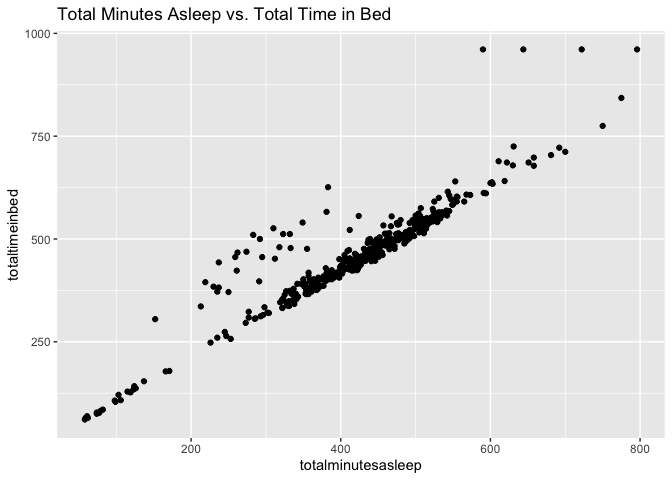

BellaBeat_Analysis_V0
================
Amer Almootassem
2022-05-22

## R Markdown

## Loading Packages

``` r
library(tidyverse)
```

    ## ── Attaching packages ─────────────────────────────────────── tidyverse 1.3.1 ──

    ## ✔ ggplot2 3.3.6     ✔ purrr   0.3.4
    ## ✔ tibble  3.1.7     ✔ dplyr   1.0.9
    ## ✔ tidyr   1.2.0     ✔ stringr 1.4.0
    ## ✔ readr   2.1.2     ✔ forcats 0.5.1

    ## ── Conflicts ────────────────────────────────────────── tidyverse_conflicts() ──
    ## ✖ dplyr::filter() masks stats::filter()
    ## ✖ dplyr::lag()    masks stats::lag()

``` r
library(lubridate)
```

    ## 
    ## Attaching package: 'lubridate'

    ## The following objects are masked from 'package:base':
    ## 
    ##     date, intersect, setdiff, union

``` r
library(dplyr)
library(ggplot2)
library(tidyr)
library(skimr)
library(janitor)
```

    ## 
    ## Attaching package: 'janitor'

    ## The following objects are masked from 'package:stats':
    ## 
    ##     chisq.test, fisher.test

## Importing the Data

``` r
daily_activity <- read_csv("dailyActivity_merged.csv", show_col_types = FALSE)
daily_calories <- read_csv("dailyCalories_merged.csv", show_col_types = FALSE)
hourly_calories <- read_csv("hourlyCalories_merged.csv", show_col_types = FALSE)
hourly_steps <- read_csv("hourlySteps_merged.csv", show_col_types = FALSE)
hourly_intensities <- read_csv("hourlyIntensities_merged.csv", show_col_types = FALSE)
daily_sleep <- read.csv("sleepDay_merged.csv")
```

Check head of each data set to ensure import was successful. Check
structure to make sure data type is correct for each column

``` r
head(daily_activity)
```

    ## # A tibble: 6 × 15
    ##        Id ActivityDate TotalSteps TotalDistance TrackerDistance LoggedActivitie…
    ##     <dbl> <chr>             <dbl>         <dbl>           <dbl>            <dbl>
    ## 1  1.50e9 4/12/16           13162          8.5             8.5                 0
    ## 2  1.50e9 4/13/16           10735          6.97            6.97                0
    ## 3  1.50e9 4/14/16           10460          6.74            6.74                0
    ## 4  1.50e9 4/15/16            9762          6.28            6.28                0
    ## 5  1.50e9 4/16/16           12669          8.16            8.16                0
    ## 6  1.50e9 4/17/16            9705          6.48            6.48                0
    ## # … with 9 more variables: VeryActiveDistance <dbl>,
    ## #   ModeratelyActiveDistance <dbl>, LightActiveDistance <dbl>,
    ## #   SedentaryActiveDistance <dbl>, VeryActiveMinutes <dbl>,
    ## #   FairlyActiveMinutes <dbl>, LightlyActiveMinutes <dbl>,
    ## #   SedentaryMinutes <dbl>, Calories <dbl>

``` r
str(daily_activity)
```

    ## spec_tbl_df [940 × 15] (S3: spec_tbl_df/tbl_df/tbl/data.frame)
    ##  $ Id                      : num [1:940] 1.5e+09 1.5e+09 1.5e+09 1.5e+09 1.5e+09 ...
    ##  $ ActivityDate            : chr [1:940] "4/12/16" "4/13/16" "4/14/16" "4/15/16" ...
    ##  $ TotalSteps              : num [1:940] 13162 10735 10460 9762 12669 ...
    ##  $ TotalDistance           : num [1:940] 8.5 6.97 6.74 6.28 8.16 ...
    ##  $ TrackerDistance         : num [1:940] 8.5 6.97 6.74 6.28 8.16 ...
    ##  $ LoggedActivitiesDistance: num [1:940] 0 0 0 0 0 0 0 0 0 0 ...
    ##  $ VeryActiveDistance      : num [1:940] 1.88 1.57 2.44 2.14 2.71 ...
    ##  $ ModeratelyActiveDistance: num [1:940] 0.55 0.69 0.4 1.26 0.41 ...
    ##  $ LightActiveDistance     : num [1:940] 6.06 4.71 3.91 2.83 5.04 ...
    ##  $ SedentaryActiveDistance : num [1:940] 0 0 0 0 0 0 0 0 0 0 ...
    ##  $ VeryActiveMinutes       : num [1:940] 25 21 30 29 36 38 42 50 28 19 ...
    ##  $ FairlyActiveMinutes     : num [1:940] 13 19 11 34 10 20 16 31 12 8 ...
    ##  $ LightlyActiveMinutes    : num [1:940] 328 217 181 209 221 164 233 264 205 211 ...
    ##  $ SedentaryMinutes        : num [1:940] 728 776 1218 726 773 ...
    ##  $ Calories                : num [1:940] 1985 1797 1776 1745 1863 ...
    ##  - attr(*, "spec")=
    ##   .. cols(
    ##   ..   Id = col_double(),
    ##   ..   ActivityDate = col_character(),
    ##   ..   TotalSteps = col_double(),
    ##   ..   TotalDistance = col_double(),
    ##   ..   TrackerDistance = col_double(),
    ##   ..   LoggedActivitiesDistance = col_double(),
    ##   ..   VeryActiveDistance = col_double(),
    ##   ..   ModeratelyActiveDistance = col_double(),
    ##   ..   LightActiveDistance = col_double(),
    ##   ..   SedentaryActiveDistance = col_double(),
    ##   ..   VeryActiveMinutes = col_double(),
    ##   ..   FairlyActiveMinutes = col_double(),
    ##   ..   LightlyActiveMinutes = col_double(),
    ##   ..   SedentaryMinutes = col_double(),
    ##   ..   Calories = col_double()
    ##   .. )
    ##  - attr(*, "problems")=<externalptr>

``` r
head(daily_calories)
```

    ## # A tibble: 6 × 3
    ##           Id ActivityDay Calories
    ##        <dbl> <chr>          <dbl>
    ## 1 1503960366 4/12/2016       1985
    ## 2 1503960366 4/13/2016       1797
    ## 3 1503960366 4/14/2016       1776
    ## 4 1503960366 4/15/2016       1745
    ## 5 1503960366 4/16/2016       1863
    ## 6 1503960366 4/17/2016       1728

``` r
str(daily_calories)
```

    ## spec_tbl_df [940 × 3] (S3: spec_tbl_df/tbl_df/tbl/data.frame)
    ##  $ Id         : num [1:940] 1.5e+09 1.5e+09 1.5e+09 1.5e+09 1.5e+09 ...
    ##  $ ActivityDay: chr [1:940] "4/12/2016" "4/13/2016" "4/14/2016" "4/15/2016" ...
    ##  $ Calories   : num [1:940] 1985 1797 1776 1745 1863 ...
    ##  - attr(*, "spec")=
    ##   .. cols(
    ##   ..   Id = col_double(),
    ##   ..   ActivityDay = col_character(),
    ##   ..   Calories = col_double()
    ##   .. )
    ##  - attr(*, "problems")=<externalptr>

``` r
head(hourly_calories)
```

    ## # A tibble: 6 × 3
    ##           Id ActivityHour          Calories
    ##        <dbl> <chr>                    <dbl>
    ## 1 1503960366 4/12/2016 12:00:00 AM       81
    ## 2 1503960366 4/12/2016 1:00:00 AM        61
    ## 3 1503960366 4/12/2016 2:00:00 AM        59
    ## 4 1503960366 4/12/2016 3:00:00 AM        47
    ## 5 1503960366 4/12/2016 4:00:00 AM        48
    ## 6 1503960366 4/12/2016 5:00:00 AM        48

``` r
str(hourly_calories)
```

    ## spec_tbl_df [22,099 × 3] (S3: spec_tbl_df/tbl_df/tbl/data.frame)
    ##  $ Id          : num [1:22099] 1.5e+09 1.5e+09 1.5e+09 1.5e+09 1.5e+09 ...
    ##  $ ActivityHour: chr [1:22099] "4/12/2016 12:00:00 AM" "4/12/2016 1:00:00 AM" "4/12/2016 2:00:00 AM" "4/12/2016 3:00:00 AM" ...
    ##  $ Calories    : num [1:22099] 81 61 59 47 48 48 48 47 68 141 ...
    ##  - attr(*, "spec")=
    ##   .. cols(
    ##   ..   Id = col_double(),
    ##   ..   ActivityHour = col_character(),
    ##   ..   Calories = col_double()
    ##   .. )
    ##  - attr(*, "problems")=<externalptr>

``` r
head(hourly_steps)
```

    ## # A tibble: 6 × 3
    ##           Id ActivityHour          StepTotal
    ##        <dbl> <chr>                     <dbl>
    ## 1 1503960366 4/12/2016 12:00:00 AM       373
    ## 2 1503960366 4/12/2016 1:00:00 AM        160
    ## 3 1503960366 4/12/2016 2:00:00 AM        151
    ## 4 1503960366 4/12/2016 3:00:00 AM          0
    ## 5 1503960366 4/12/2016 4:00:00 AM          0
    ## 6 1503960366 4/12/2016 5:00:00 AM          0

``` r
str(hourly_steps)
```

    ## spec_tbl_df [22,099 × 3] (S3: spec_tbl_df/tbl_df/tbl/data.frame)
    ##  $ Id          : num [1:22099] 1.5e+09 1.5e+09 1.5e+09 1.5e+09 1.5e+09 ...
    ##  $ ActivityHour: chr [1:22099] "4/12/2016 12:00:00 AM" "4/12/2016 1:00:00 AM" "4/12/2016 2:00:00 AM" "4/12/2016 3:00:00 AM" ...
    ##  $ StepTotal   : num [1:22099] 373 160 151 0 0 ...
    ##  - attr(*, "spec")=
    ##   .. cols(
    ##   ..   Id = col_double(),
    ##   ..   ActivityHour = col_character(),
    ##   ..   StepTotal = col_double()
    ##   .. )
    ##  - attr(*, "problems")=<externalptr>

``` r
head(hourly_intensities)
```

    ## # A tibble: 6 × 4
    ##           Id ActivityHour          TotalIntensity AverageIntensity
    ##        <dbl> <chr>                          <dbl>            <dbl>
    ## 1 1503960366 4/12/2016 12:00:00 AM             20            0.333
    ## 2 1503960366 4/12/2016 1:00:00 AM               8            0.133
    ## 3 1503960366 4/12/2016 2:00:00 AM               7            0.117
    ## 4 1503960366 4/12/2016 3:00:00 AM               0            0    
    ## 5 1503960366 4/12/2016 4:00:00 AM               0            0    
    ## 6 1503960366 4/12/2016 5:00:00 AM               0            0

``` r
str(hourly_intensities)
```

    ## spec_tbl_df [22,099 × 4] (S3: spec_tbl_df/tbl_df/tbl/data.frame)
    ##  $ Id              : num [1:22099] 1.5e+09 1.5e+09 1.5e+09 1.5e+09 1.5e+09 ...
    ##  $ ActivityHour    : chr [1:22099] "4/12/2016 12:00:00 AM" "4/12/2016 1:00:00 AM" "4/12/2016 2:00:00 AM" "4/12/2016 3:00:00 AM" ...
    ##  $ TotalIntensity  : num [1:22099] 20 8 7 0 0 0 0 0 13 30 ...
    ##  $ AverageIntensity: num [1:22099] 0.333 0.133 0.117 0 0 ...
    ##  - attr(*, "spec")=
    ##   .. cols(
    ##   ..   Id = col_double(),
    ##   ..   ActivityHour = col_character(),
    ##   ..   TotalIntensity = col_double(),
    ##   ..   AverageIntensity = col_double()
    ##   .. )
    ##  - attr(*, "problems")=<externalptr>

``` r
head(daily_sleep)
```

    ##           Id              SleepDay TotalSleepRecords TotalMinutesAsleep
    ## 1 1503960366 4/12/2016 12:00:00 AM                 1                327
    ## 2 1503960366 4/13/2016 12:00:00 AM                 2                384
    ## 3 1503960366 4/15/2016 12:00:00 AM                 1                412
    ## 4 1503960366 4/16/2016 12:00:00 AM                 2                340
    ## 5 1503960366 4/17/2016 12:00:00 AM                 1                700
    ## 6 1503960366 4/19/2016 12:00:00 AM                 1                304
    ##   TotalTimeInBed
    ## 1            346
    ## 2            407
    ## 3            442
    ## 4            367
    ## 5            712
    ## 6            320

``` r
str(daily_sleep)
```

    ## 'data.frame':    413 obs. of  5 variables:
    ##  $ Id                : num  1.5e+09 1.5e+09 1.5e+09 1.5e+09 1.5e+09 ...
    ##  $ SleepDay          : chr  "4/12/2016 12:00:00 AM" "4/13/2016 12:00:00 AM" "4/15/2016 12:00:00 AM" "4/16/2016 12:00:00 AM" ...
    ##  $ TotalSleepRecords : int  1 2 1 2 1 1 1 1 1 1 ...
    ##  $ TotalMinutesAsleep: int  327 384 412 340 700 304 360 325 361 430 ...
    ##  $ TotalTimeInBed    : int  346 407 442 367 712 320 377 364 384 449 ...

## Notes on data review:

    Date column in all datasets is set to chr not a date/time format.
    Clean and rename columns before data type change

Change columns to all lower case

``` r
clean_names(daily_activity)
daily_activity<- rename_with(daily_activity, tolower)
clean_names(daily_calories)
daily_calories<- rename_with(daily_calories, tolower)
clean_names(hourly_calories)
hourly_calories<- rename_with(hourly_calories, tolower)
clean_names(hourly_steps)
hourly_steps <- rename_with(hourly_steps, tolower)
clean_names(hourly_intensities)
hourly_intensities <- rename_with(hourly_intensities, tolower)
clean_names(daily_sleep)
daily_sleep <- rename_with(daily_sleep, tolower)
```

Rename date/day columns to date

``` r
daily_activity <- daily_activity %>%
  rename(date = activitydate)
daily_calories <- daily_calories %>%
  rename(date = activityday)
daily_sleep <- daily_sleep %>%
  rename(date = sleepday)
```

Rename date/day/time columns to date_time

``` r
hourly_calories <- hourly_calories %>%
  rename(date_time = activityhour)
hourly_steps <- hourly_steps %>%
  rename(date_time = activityhour)
hourly_intensities <- hourly_intensities %>%
  rename(date_time = activityhour)
```

Change date column from char to date format

``` r
daily_activity$date<-mdy(daily_activity$date)
daily_calories$date<-mdy(daily_calories$date)
daily_sleep <- daily_sleep %>%
  mutate(date = as_date(date,format ="%m/%d/%Y %I:%M:%S %p" , tz=Sys.timezone()))
```

    ## Warning: `tz` argument is ignored by `as_date()`

Change date_time column from char to date time format

``` r
hourly_calories<- hourly_calories %>% 
  mutate(date_time = as.POSIXct(date_time,format ="%m/%d/%Y %I:%M:%S %p" , tz=Sys.timezone()))
hourly_steps<- hourly_steps %>% 
  mutate(date_time = as.POSIXct(date_time,format ="%m/%d/%Y %I:%M:%S %p" , tz=Sys.timezone()))
hourly_intensities<- hourly_intensities%>% 
  mutate(date_time = as.POSIXct(date_time,format ="%m/%d/%Y %I:%M:%S %p" , tz=Sys.timezone()))
```

## Exploring the data sets before starting the analyze phase

``` r
n_unique(daily_activity$id)
```

    ## [1] 33

``` r
n_unique(daily_calories$id)
```

    ## [1] 33

``` r
n_unique(hourly_calories$id)
```

    ## [1] 33

``` r
n_unique(hourly_steps$id)
```

    ## [1] 33

``` r
n_unique(hourly_intensities$id)
```

    ## [1] 33

``` r
n_unique(daily_sleep$id)
```

    ## [1] 24

All datasets have 33 user data, except for daily_sleep- only 24 user
data is collected Sleep dataset will be used as reference only

Check for duplicates

``` r
sum(duplicated(daily_activity))
```

    ## [1] 0

``` r
sum(duplicated(daily_calories))
```

    ## [1] 0

``` r
sum(duplicated(hourly_calories))
```

    ## [1] 0

``` r
sum(duplicated(hourly_steps))
```

    ## [1] 0

``` r
sum(duplicated(hourly_intensities))
```

    ## [1] 0

``` r
sum(duplicated(daily_sleep))
```

    ## [1] 3

daily_sleep has 3 duplicates. Drop the duplicates

``` r
daily_sleep <- daily_sleep %>%
  distinct() %>%
  drop_na()
sum(duplicated(daily_sleep))
```

    ## [1] 0

All duplicates are cleaned up and we are ready for analysis

First step will be to analyze the users daily logs to spot any trends of
interest. Start by merging daily activity and daily sleep

``` r
daily_activity_sleep <- merge(daily_activity, daily_sleep, by=c ("id", "date"))
head(daily_activity_sleep)
```

    ##           id       date totalsteps totaldistance trackerdistance
    ## 1 1503960366 2016-04-12      13162          8.50            8.50
    ## 2 1503960366 2016-04-13      10735          6.97            6.97
    ## 3 1503960366 2016-04-15       9762          6.28            6.28
    ## 4 1503960366 2016-04-16      12669          8.16            8.16
    ## 5 1503960366 2016-04-17       9705          6.48            6.48
    ## 6 1503960366 2016-04-19      15506          9.88            9.88
    ##   loggedactivitiesdistance veryactivedistance moderatelyactivedistance
    ## 1                        0               1.88                     0.55
    ## 2                        0               1.57                     0.69
    ## 3                        0               2.14                     1.26
    ## 4                        0               2.71                     0.41
    ## 5                        0               3.19                     0.78
    ## 6                        0               3.53                     1.32
    ##   lightactivedistance sedentaryactivedistance veryactiveminutes
    ## 1                6.06                       0                25
    ## 2                4.71                       0                21
    ## 3                2.83                       0                29
    ## 4                5.04                       0                36
    ## 5                2.51                       0                38
    ## 6                5.03                       0                50
    ##   fairlyactiveminutes lightlyactiveminutes sedentaryminutes calories
    ## 1                  13                  328              728     1985
    ## 2                  19                  217              776     1797
    ## 3                  34                  209              726     1745
    ## 4                  10                  221              773     1863
    ## 5                  20                  164              539     1728
    ## 6                  31                  264              775     2035
    ##   totalsleeprecords totalminutesasleep totaltimeinbed
    ## 1                 1                327            346
    ## 2                 2                384            407
    ## 3                 1                412            442
    ## 4                 2                340            367
    ## 5                 1                700            712
    ## 6                 1                304            320

``` r
glimpse(daily_activity_sleep)
```

    ## Rows: 410
    ## Columns: 18
    ## $ id                       <dbl> 1503960366, 1503960366, 1503960366, 150396036…
    ## $ date                     <date> 2016-04-12, 2016-04-13, 2016-04-15, 2016-04-…
    ## $ totalsteps               <dbl> 13162, 10735, 9762, 12669, 9705, 15506, 10544…
    ## $ totaldistance            <dbl> 8.50, 6.97, 6.28, 8.16, 6.48, 9.88, 6.68, 6.3…
    ## $ trackerdistance          <dbl> 8.50, 6.97, 6.28, 8.16, 6.48, 9.88, 6.68, 6.3…
    ## $ loggedactivitiesdistance <dbl> 0, 0, 0, 0, 0, 0, 0, 0, 0, 0, 0, 0, 0, 0, 0, …
    ## $ veryactivedistance       <dbl> 1.88, 1.57, 2.14, 2.71, 3.19, 3.53, 1.96, 1.3…
    ## $ moderatelyactivedistance <dbl> 0.55, 0.69, 1.26, 0.41, 0.78, 1.32, 0.48, 0.3…
    ## $ lightactivedistance      <dbl> 6.06, 4.71, 2.83, 5.04, 2.51, 5.03, 4.24, 4.6…
    ## $ sedentaryactivedistance  <dbl> 0, 0, 0, 0, 0, 0, 0, 0, 0, 0, 0, 0, 0, 0, 0, …
    ## $ veryactiveminutes        <dbl> 25, 21, 29, 36, 38, 50, 28, 19, 41, 39, 73, 3…
    ## $ fairlyactiveminutes      <dbl> 13, 19, 34, 10, 20, 31, 12, 8, 21, 5, 14, 23,…
    ## $ lightlyactiveminutes     <dbl> 328, 217, 209, 221, 164, 264, 205, 211, 262, …
    ## $ sedentaryminutes         <dbl> 728, 776, 726, 773, 539, 775, 818, 838, 732, …
    ## $ calories                 <dbl> 1985, 1797, 1745, 1863, 1728, 2035, 1786, 177…
    ## $ totalsleeprecords        <int> 1, 2, 1, 2, 1, 1, 1, 1, 1, 1, 1, 1, 1, 1, 1, …
    ## $ totalminutesasleep       <int> 327, 384, 412, 340, 700, 304, 360, 325, 361, …
    ## $ totaltimeinbed           <int> 346, 407, 442, 367, 712, 320, 377, 364, 384, …

``` r
n_unique(daily_activity_sleep$id)
```

    ## [1] 24

Visualize total steps and calories

``` r
ggplot(data=daily_activity, aes(x=totalsteps, y=calories)) + 
  geom_point() + geom_smooth() + labs(title="Total Steps vs. Calories")
```

    ## `geom_smooth()` using method = 'loess' and formula 'y ~ x'

<!-- -->

``` r
ggplot(data=daily_activity_sleep, aes(x=totalsteps, y=totalminutesasleep)) + 
  geom_point() + geom_smooth() + labs(title="Total Steps vs. Minutes Asleep")
```

    ## `geom_smooth()` using method = 'loess' and formula 'y ~ x'

<!-- -->

``` r
ggplot(data=daily_activity_sleep, aes(x=id,y=totalsteps)) + 
  geom_bar(stat = "identity") + labs(title="User vs. Total Steps")+
  coord_flip()
```

<!-- -->

After reviewing the 3 graphs, we notice that users from with widely
varying activity levels use the fitness tracker. There might be some
valuable insights if we group users by activity level

Group users by activity level

``` r
daily_average <- daily_activity_sleep %>%
  group_by(id) %>%
  summarise (mean_daily_steps = mean(totalsteps), mean_daily_sleep = mean(totalminutesasleep))

head(daily_average)
```

    ## # A tibble: 6 × 3
    ##           id mean_daily_steps mean_daily_sleep
    ##        <dbl>            <dbl>            <dbl>
    ## 1 1503960366           12406.             360.
    ## 2 1644430081            7968.             294 
    ## 3 1844505072            3477              652 
    ## 4 1927972279            1490              417 
    ## 5 2026352035            5619.             506.
    ## 6 2320127002            5079               61

<https://www.medicinenet.com/how_many_steps_a_day_is_considered_active/article.htm>
Categories defined in the link above Limit grouping to 4 categories to
match active minutes grouping in dataset

``` r
user_class <- daily_average %>%
  mutate(user_class = case_when(
    mean_daily_steps < 5000 ~ "sedentary",
    mean_daily_steps >= 5000 & mean_daily_steps < 7499 ~ "low active", 
    mean_daily_steps >= 7500 & mean_daily_steps < 9999 ~ "fairly active", 
    mean_daily_steps >= 10000~ "very active"
  ))

head(user_class)
```

    ## # A tibble: 6 × 4
    ##           id mean_daily_steps mean_daily_sleep user_class   
    ##        <dbl>            <dbl>            <dbl> <chr>        
    ## 1 1503960366           12406.             360. very active  
    ## 2 1644430081            7968.             294  fairly active
    ## 3 1844505072            3477              652  sedentary    
    ## 4 1927972279            1490              417  sedentary    
    ## 5 2026352035            5619.             506. low active   
    ## 6 2320127002            5079               61  low active

``` r
ggplot(data=user_class, aes(x=user_class,y=id)) + 
  geom_bar(stat = "identity") + labs(title="Users per activity level")
```

<!-- -->

The bar graph shows all four categories have many users Pie chart
showing percentage breakdown is better format to communicate user class
grouping

``` r
user_count <- user_class %>% 
  group_by(user_class) %>%
  summarise(Count = n())
head(user_count)
```

    ## # A tibble: 4 × 2
    ##   user_class    Count
    ##   <chr>         <int>
    ## 1 fairly active     9
    ## 2 low active        5
    ## 3 sedentary         5
    ## 4 very active       5

``` r
percent_users <- user_count %>% 
  mutate(total = sum(Count)) %>% 
  group_by(user_class) %>%
  summarise(total_percent = Count / total) %>%
  mutate(labels = scales::percent(total_percent))
head(percent_users)
```

    ## # A tibble: 4 × 3
    ##   user_class    total_percent labels
    ##   <chr>                 <dbl> <chr> 
    ## 1 fairly active         0.375 38%   
    ## 2 low active            0.208 21%   
    ## 3 sedentary             0.208 21%   
    ## 4 very active           0.208 21%

Breakdown of different categories

``` r
percent_users %>%
  ggplot(aes(x="",y=total_percent, fill=user_class)) +
  geom_bar(stat = "identity", width = 1)+
  coord_polar("y", start=0)+
  theme_minimal()+
  theme(axis.title.x= element_blank(),
        axis.title.y = element_blank(),
        panel.border = element_blank(), 
        panel.grid = element_blank(), 
        axis.ticks = element_blank(),
        axis.text.x = element_blank(),
        plot.title = element_text(size=15, face = "bold")) +
  geom_text(aes(label = labels),
            position = position_stack(vjust = 0.5))+
  labs(title="User Percentage per Activity Level")
```

<!-- -->

From the above pie chart, we can conclude that users with varying
activity levels use the fitness tracker

Do users with higher activity level sleep more?

``` r
user_activity_sleep <- merge(daily_activity_sleep, user_class, by=c ("id"))
head(user_activity_sleep)
```

    ##           id       date totalsteps totaldistance trackerdistance
    ## 1 1503960366 2016-04-12      13162          8.50            8.50
    ## 2 1503960366 2016-04-13      10735          6.97            6.97
    ## 3 1503960366 2016-04-15       9762          6.28            6.28
    ## 4 1503960366 2016-04-16      12669          8.16            8.16
    ## 5 1503960366 2016-04-17       9705          6.48            6.48
    ## 6 1503960366 2016-04-19      15506          9.88            9.88
    ##   loggedactivitiesdistance veryactivedistance moderatelyactivedistance
    ## 1                        0               1.88                     0.55
    ## 2                        0               1.57                     0.69
    ## 3                        0               2.14                     1.26
    ## 4                        0               2.71                     0.41
    ## 5                        0               3.19                     0.78
    ## 6                        0               3.53                     1.32
    ##   lightactivedistance sedentaryactivedistance veryactiveminutes
    ## 1                6.06                       0                25
    ## 2                4.71                       0                21
    ## 3                2.83                       0                29
    ## 4                5.04                       0                36
    ## 5                2.51                       0                38
    ## 6                5.03                       0                50
    ##   fairlyactiveminutes lightlyactiveminutes sedentaryminutes calories
    ## 1                  13                  328              728     1985
    ## 2                  19                  217              776     1797
    ## 3                  34                  209              726     1745
    ## 4                  10                  221              773     1863
    ## 5                  20                  164              539     1728
    ## 6                  31                  264              775     2035
    ##   totalsleeprecords totalminutesasleep totaltimeinbed mean_daily_steps
    ## 1                 1                327            346         12405.68
    ## 2                 2                384            407         12405.68
    ## 3                 1                412            442         12405.68
    ## 4                 2                340            367         12405.68
    ## 5                 1                700            712         12405.68
    ## 6                 1                304            320         12405.68
    ##   mean_daily_sleep  user_class
    ## 1           360.28 very active
    ## 2           360.28 very active
    ## 3           360.28 very active
    ## 4           360.28 very active
    ## 5           360.28 very active
    ## 6           360.28 very active

``` r
glimpse(user_activity_sleep)
```

    ## Rows: 410
    ## Columns: 21
    ## $ id                       <dbl> 1503960366, 1503960366, 1503960366, 150396036…
    ## $ date                     <date> 2016-04-12, 2016-04-13, 2016-04-15, 2016-04-…
    ## $ totalsteps               <dbl> 13162, 10735, 9762, 12669, 9705, 15506, 10544…
    ## $ totaldistance            <dbl> 8.50, 6.97, 6.28, 8.16, 6.48, 9.88, 6.68, 6.3…
    ## $ trackerdistance          <dbl> 8.50, 6.97, 6.28, 8.16, 6.48, 9.88, 6.68, 6.3…
    ## $ loggedactivitiesdistance <dbl> 0, 0, 0, 0, 0, 0, 0, 0, 0, 0, 0, 0, 0, 0, 0, …
    ## $ veryactivedistance       <dbl> 1.88, 1.57, 2.14, 2.71, 3.19, 3.53, 1.96, 1.3…
    ## $ moderatelyactivedistance <dbl> 0.55, 0.69, 1.26, 0.41, 0.78, 1.32, 0.48, 0.3…
    ## $ lightactivedistance      <dbl> 6.06, 4.71, 2.83, 5.04, 2.51, 5.03, 4.24, 4.6…
    ## $ sedentaryactivedistance  <dbl> 0, 0, 0, 0, 0, 0, 0, 0, 0, 0, 0, 0, 0, 0, 0, …
    ## $ veryactiveminutes        <dbl> 25, 21, 29, 36, 38, 50, 28, 19, 41, 39, 73, 3…
    ## $ fairlyactiveminutes      <dbl> 13, 19, 34, 10, 20, 31, 12, 8, 21, 5, 14, 23,…
    ## $ lightlyactiveminutes     <dbl> 328, 217, 209, 221, 164, 264, 205, 211, 262, …
    ## $ sedentaryminutes         <dbl> 728, 776, 726, 773, 539, 775, 818, 838, 732, …
    ## $ calories                 <dbl> 1985, 1797, 1745, 1863, 1728, 2035, 1786, 177…
    ## $ totalsleeprecords        <int> 1, 2, 1, 2, 1, 1, 1, 1, 1, 1, 1, 1, 1, 1, 1, …
    ## $ totalminutesasleep       <int> 327, 384, 412, 340, 700, 304, 360, 325, 361, …
    ## $ totaltimeinbed           <int> 346, 407, 442, 367, 712, 320, 377, 364, 384, …
    ## $ mean_daily_steps         <dbl> 12405.68, 12405.68, 12405.68, 12405.68, 12405…
    ## $ mean_daily_sleep         <dbl> 360.28, 360.28, 360.28, 360.28, 360.28, 360.2…
    ## $ user_class               <chr> "very active", "very active", "very active", …

``` r
avg_sleep_userclass <-user_activity_sleep %>% 
  group_by(user_class) %>%
  summarise(avg_sleep=mean(totalminutesasleep))
head(avg_sleep_userclass)
```

    ## # A tibble: 4 × 2
    ##   user_class    avg_sleep
    ##   <chr>             <dbl>
    ## 1 fairly active      435.
    ## 2 low active         455.
    ## 3 sedentary          415 
    ## 4 very active        371.

``` r
ggplot(data=avg_sleep_userclass, aes(x=user_class, y=avg_sleep, fill=user_class)) + 
  geom_bar(stat = "identity")+ labs(title="Average Sleep Minutes per User Class", ) + theme_minimal()
```

<!-- -->

The variation between user groups is minimal and we can conclude
activity level does not affect sleep length. However, it’s possible
sleep quality is affected by activity level. Further research is
required Possible feature for future implementation

Another option to consider is time in bed vs time asleep

``` r
ggplot(data=daily_sleep, aes(x=totalminutesasleep, y=totaltimeinbed)) + 
  geom_point()+ labs(title="Total Minutes Asleep vs. Total Time in Bed")
```

<!-- -->

It seems that timein bed has a stronger correlation with time asleep
Feature idea: add notification option to encourage users to go to sleep

# CONCLUSIONS

1.  users with varying activity levels use the fitness tracker
2.  activity level does not affect sleep length
3.  time in bed has a stronger correlation with time asleep

# ICE BOX/ FUTURE IDEAS

1.  Research sleep quality metric and possible implementation
2.  add notification option to encourage users to go to sleep
